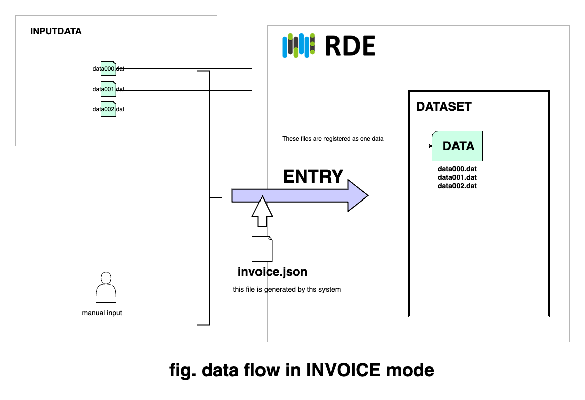
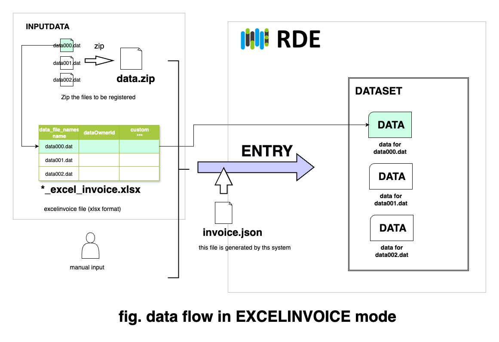
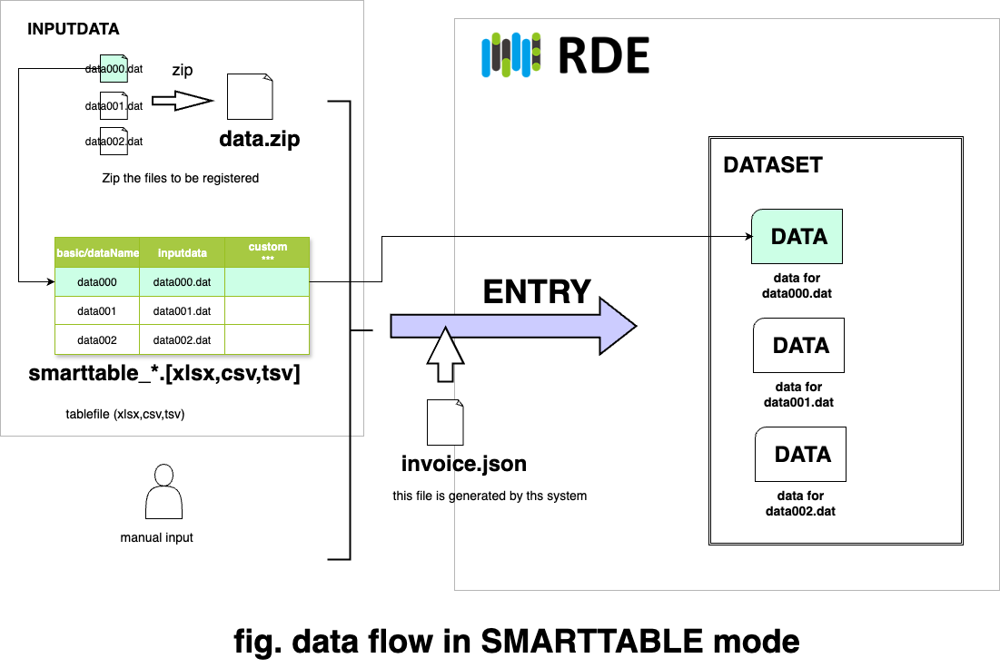
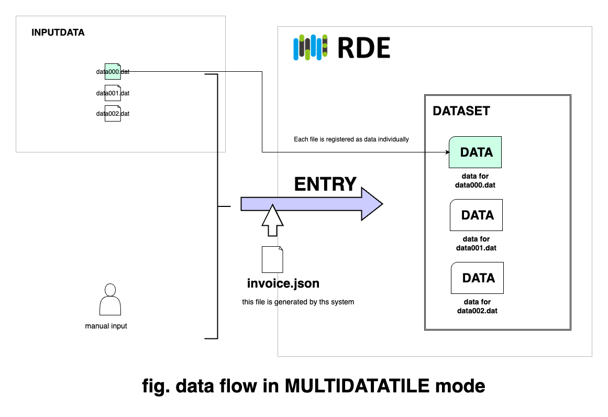

# RDEToolKitデータ登録モード対応データセットテンプレートについて

## 目的
- RDEToolKitに用意されたデータ登録の5モードそれぞれのデータセットテンプレートを提供します
- 各データ登録モードを実際に動作させながら説明します
- データ登録モードはRDEに１つまたは複数のデータを登録するための数種類の方法を提供します
- データ登録の形態に合わせて入力ファイル、出力先を初期配置する機能です
- 用意されているデータ登録モードは以下の通りです
  1. Invoice mode
    - 1回の登録で1件のデータを登録できる
  2. ExcelInvoice mode
    - 1回の登録で複数のデータを登録できる
    - 登録ファイル、送状項目をエクセル形式のファイルで指定
    - 送状項目をまとめて入力できる
  3. SmartTableInvoice mode
    - 1回の登録で複数のデータを登録できる
    - Excelinvoiceをより使いやすくしたもの
    - 登録ファイル、送状項目をCSV、TSV、エクセル形式のいずれかののファイルで指定
    - 送状項目をまとめて入力できる
  4. MultiDataTile mode
    - 1回の登録で複数のデータを登録できる
    - ただし送状項目は同一
  5. RDEFormat mode
    - 構造化処理済みのRDEformat形式のファイル一式を入力ファイルとする
    - 1回の登録で1件または複数のデータを登録できる
- この資料では提供しているテンプレートを使わずに各登録モードを使って構造化処理の準備を行う手順を説明します
- 提供しているテンプレートを利用については各readme.mdを参照してください
- なお、登録モードの動作の解説を対象としているため、構造化処理については実装していません
- SmartTableInvoiceモードはRDEToolKit v1.3以降で利用できるようになりました

## 提供しているテンプレート
1. Invoice mode
  - [Invoice mode用データセットテンプレート](DatasetTemplates/mode_invoice/)
2. ExcelInvoice mode
  - [ExcelInvoice mode用データセットテンプレート](DatasetTemplates/mode_excelinvoice/)
3. SmartTableInvoice mode
  - [SmartTableInvoice mode用データセットテンプレート](DatasetTemplates/mode_smarttableinvoice/)
4. MultiDataTile mode
  - [MultiDataTile mode用データセットテンプレート](DatasetTemplates/mode_multidatatile//)
5. RDEFromat mode
  - [RDEFormat mode用データセットテンプレート](DatasetTemplates/mode_rdeformat/)

## 始める前に

以降では各データ登録モードに対応した処理を手作業で作っていく手順を説明しています。RDEToolKitのデータ登録モードを動作させながら説明していますのでご興味のある方は試してみてください。

動作環境として以下を用意してください。

1. Windowsを利用している場合はWSLでUbuntu 24.04以上
2. python v3.13以上
3. RDEToolKit v.1.3.4以降(pipで導入)

## Invoice mode



参照: [RDEToolKit Documentation Invoiceモードとは](https://nims-mdpf.github.io/rdetoolkit/usage/mode/mode_invoice/)

- `Invoice mode`は、1回のデータ登録(データ登録アプリの送状画面1つ)で1件のデータ(データタイル)として登録する際に利用します
- `1登録で1データ`です
- 提供しているデータセットテンプレートを利用する場合は、DatasetTemplates/mode_invoiceをコピーして使ってください
- ここではRDEToolKitを使って初期化するところから順を追って説明しています(初めから作ってみたい人は是非に)
- 最終的にできあがるものは DatasetTemplates/mode_invoice と同じ内容です
- 登録データのサンプルはDatasetTemplates/mode_invoice/input/inputdataにあります
- docker containerを使って実行したい方はmode_invoiceのreadme.mdを参照してください

### 準備

1. 作業用のディレクトリを作成し、ここをワークディレクトリとします。
    ```cmd
    $ mkdir mode_invoice
    $ cd mode_invoice
    ```
2. RDEToolKitを使って構造化処理の雛形を用意する<br >下記のようにディレクトリとファイルが配置されます
    ```cmd
    mode_invoice $ python -m rdetoolkit init
    Ready to develop a structured program for RDE.
    Created: mode_invoice/container/requirements.txt
    Created: mode_invoice/container/Dockerfile
    Created: mode_invoice/container/data/invoice/invoice.json
    Created: mode_invoice/container/data/tasksupport/invoice.schema.json
    Created: mode_invoice/container/data/tasksupport/metadata-def.json
    Created: mode_invoice/templates/tasksupport/invoice.schema.json
    Created: mode_invoice/templates/tasksupport/metadata-def.json
    Created: mode_invoice/input/invoice/invoice.json

    Check the folder: mode_invoice
    Done!
    ```
3. ワークディレクトリをcontainerに変更
    ```cmd
    mode_invoice $ cd container
    ```
4. 入力ファイルを配置します<br>データパースはしないためサイズが0バイトのファイルを入力ファイルとしています<br>他のモードとの比較ため、入力ファイルを3つ作っています。この3ファイルを1件のデータとして登録します。
    ```cmd
    container $ mkdir -p data/inputdata
    container $ touch data/inputdata/data000.dat
    container $ touch data/inputdata/data001.dat
    container $ touch data/inputdata/data002.dat
    ```
5. プログラムの入力<br>`main.py`をcontainer以下に作成<br>以下の内容をファイルに転記して保存
    ```python
    import rdetoolkit
    from modules import datasets_process

    rdetoolkit.workflows.run(custom_dataset_function=datasets_process.dataset)
    ```
5. プログラムの入力<br>`datasets_process.py`をcontainer/modules以下に作成<br>以下の内容をファイルに転記して保存
    ```python
    from rdetoolkit.errors import catch_exception_with_message
    from rdetoolkit.models.rde2types import RdeInputDirPaths, RdeOutputResourcePath

    @catch_exception_with_message(error_message="ERROR: failed in data processing")
    def dataset(srcpaths: RdeInputDirPaths, resource_paths: RdeOutputResourcePath) -> None:
        # 各データ単位の入力ファイルの一覧を出力
        print(resource_paths.rawfiles)
    ```


以上で準備は完了です。

Invoice modeで最低限動かす場合は上記のような構成で足ります。

### 動かしてみる

では、実際に動かしてみます。

実行前と実行後のファイルの配置を比較するため、ファイル構成をみながら進めます。

実行前のファイル構成
```cmd
container $ tree　data
data
├── inputdata
│   ├── data000.dat
│   ├── data001.dat
│   └── data002.dat
├── invoice
│   └── invoice.json
└── tasksupport
    ├── invoice.schema.json
    └── metadata-def.json
```

実行中 エラーがなく、下記のようにファイルパスの一覧が出力されたら正常終了です。
```cmd
container $ python main.py
(PosixPath('data/inputdata/data001.dat'), PosixPath('data/inputdata/data000.dat'), PosixPath('data/inputdata/data002.dat'))
container $
```

実行後のファイル構成
```cmd
container $ tree data
data
├── attachment
├── inputdata
│   ├── data000.dat
│   ├── data001.dat
│   └── data002.dat
├── invoice
│   └── invoice.json
├── invoice_patch
├── logs
├── main_image
├── meta
├── nonshared_raw
│   ├── data000.dat
│   ├── data001.dat
│   └── data002.dat
├── other_image
├── raw
├── structured
├── tasksupport
│   ├── invoice.schema.json
│   └── metadata-def.json
├── temp
└── thumbnail
```

### 実行後のファイル構成をみながらRDEToolKitのモードの役割について説明
- 実行前と実行後とのファイル配置の違いを確認してください
- 実行後に新たに作成されたディレクトリがいくつかあります(structured,main_image,other_image、metaなど)
  - 各ディレクトリの説明は[ファーストタッチドキュメント doc1](https://github.com/nims-mdpf/RDE_Docs_firsttouch/tree/main/doc1)を参照してください
- 特にraw、nonshared_rawに注目してください
  - RDEToolKitを用いたプログラムでは、実行後はinputdataに配置された入力ファイルは標準ではnonshared_rawに配置されます
  - rawフォルダに配置されたファイルはエンバーゴ期間終了後に公開されます
  - nonshared_rawに配置したファイルはエンバーゴ期間終了後も非公開となります
- inputdataに配置された3ファイルがnonshared_rawにコピーされていますが、これがRDEToolKitのデータ登録モードの処理によるものです
  - このようにRDEToolKitではデータ登録モードに合わせてファイルを初期配置します
  - この配置されたファイルに対してデータパース(メタデータや数値データを取り出す)などの構造化処理のプログラムを作成するのが開発者の作業となります


### 余談　srcpaths: RdeInputDirPaths, resource_paths: RdeOutputResourcePathについて

- データ登録モードに従って配置されたファイルはパスは、RdeInputDirPaths、RdeOutputResourcePath(これらクラスのインスタンス)に保持されます
- 先のInvoice modeで実行しときの各インスタンスの値をみてみます

srcpaths: RdeInputDirPaths
```python
RdeInputDirPaths(
    inputdata=PosixPath('data/inputdata'),
    invoice=PosixPath('data/invoice'),
    tasksupport=PosixPath('data/tasksupport'), 
    config=Config(
        system=SystemSettings(extended_mode=None, save_raw=False, save_nonshared_raw=True, save_thumbnail_image=False, magic_variable=False),
        multidata_tile=MultiDataTileSettings(ignore_errors=False),
        smarttable=None
    )
)
```

resource_paths: RdeOutputResourcePath
```python
RdeOutputResourcePath(
    raw=PosixPath('data/raw'),
    nonshared_raw=PosixPath('data/nonshared_raw'),
    rawfiles=(PosixPath('data/inputdata/data001.dat'),
              PosixPath('data/inputdata/data000.dat'),
              PosixPath('data/inputdata/data002.dat')),
    struct=PosixPath('data/structured'),
    main_image=PosixPath('data/main_image'),
    other_image=PosixPath('data/other_image'),
    meta=PosixPath('data/meta'), thumbnail=PosixPath('data/thumbnail'),
    logs=PosixPath('data/logs'), invoice=PosixPath('data/invoice'),
    invoice_schema_json=PosixPath('data/tasksupport/invoice.schema.json'),
    invoice_org=PosixPath('data/invoice/invoice.json'),
    temp=PosixPath('data/temp'),
    invoice_patch=PosixPath('data/invoice_patch'),
    attachment=PosixPath('data/attachment')
)
```

- 入力ファイルをデータパースする際は、resource_paths.rawfilesによってファイルパスを取得することができます
- 構造化処理の結果を出力する場合は、resource_paths.structなどを書き込み先として指定します

## ExcelInvoice mode



参照: [RDEToolKit Documentation ExcelInvoiceモードとは](https://nims-mdpf.github.io/rdetoolkit/usage/mode/mode_excelinvoice/)
- `ExcelInvoice mode`は、1回のデータ登録(データ登録アプリの送状画面1つ)で複数件のデータ(データタイル)として登録する際に利用します
- 登録するファイル、送状の入力項目はエクセルインボイス(エクセル形式のファイル(*_excel_invoice.xlsx))に書き込みます
- また、登録ファイルはzip形式で１つにまとめて登録します
- ファイルのまとめかたは、ファイルモード、フォルダーモードがあります
  - ファイルモード : 登録するファイル(1データ1ファイル)一式をzip形式でまとめます
  - フォルダモード : 登録するファイルが複数の組み合わせの場合に利用。フォルダ単位でファイルをまとめておき、フォルダごとzip形式でまとめます
- `1登録で複数データ`で、1データごとに`送状の内容を変えられます`
- 提供しているデータセットテンプレートを利用する場合は、DatasetTemplates/mode_excelinvoiceをコピーして使ってください
- ここではRDEToolKitを使って初期化するところから順を追って説明しています(初めから作ってみたい人は是非に)
- 最終的にできあがるものは DatasetTemplates/mode_excelinvoice と同じ内容です
- 登録データのサンプルはmode_excelinvoice/inputにあります
  - ファイルモード : mode_excelinvoice/input/file_mode
  - フォルダモード : mode_excelinvoice/input/folder_mode
- docker containerを使って実行したい方はmode_excelinvoice/readme.mdを参照してください
- 以下の説明ではフォルダモードについて説明しています

### 準備

新たにエクセルインボイス用のディレクトリを作成し雛形ファイルを作成します

```cmd
$ mkdir mode_excelinvoice
$ cd  mode_excelinvoice
mode_excelinvoice $ python -m rdetoolkit init
mode_excelinvoice $ cd container
container $
```

さらに、main.pyとdatasets_process.pyをInvoice modeと同じ内容でそれぞれ所定のフォルダに配置します。

入力ファイルを準備します。
data000.dat、data001.dat、data002.datをそれぞれデータとして登録します。1回の登録で3データが登録されます。
```cmd
container $ touch data000.dat
container $ touch data001.dat
container $ touch data002.dat
container $ zip data.zip data???.dat
  adding: data000.dat (stored 0%)
  adding: data001.dat (stored 0%)
  adding: data002.dat (stored 0%)
container $ cp data.zip data/inputdata
```

以下はフォルダモードのときのzipファイルの作り方の事例です
```
$ zip -r data.zip data000 data001 data002 
  adding: data000/ (stored 0%)
  adding: data000/data000.dat (stored 0%)
  adding: data001/ (stored 0%)
  adding: data001/data001.dat (stored 0%)
  adding: data002/ (stored 0%)
  adding: data002/data002.dat (stored 0%)
```

### RDEToolKitでexcelinvoiceファイルを作る

- 先に試したinvoiceモードをexcelinvoiceモードに変更してみます
- RDEToolKitにはinvoice.schema.jsonからエクセルインボイスファイルの雛形を作成する機能があります
- なお、エクセルインボイスファイルとして用いるExcelファイルはファイル名の末尾が`_excel_invoice.xlsx`である必要があります

```cmd 
container $ python -m rdetoolkit --help
Usage: python -m rdetoolkit [OPTIONS] COMMAND [ARGS]...

  CLI generates template projects for RDE structured programs.

Options:
  --help  Show this message and exit.

Commands:
  artifact           Create an artifact (.zip) for submission to RDE by...
  init               Output files needed to build RDE structured programs.
  make-excelinvoice  Generate an Excel invoice based on the provided...
  version            Command to display version.
```

tasksupportに含まれるinvoice.schema.jsonからエクセルインボイスファイル(xlsx)を作成する
```cmd 
container $ python -m rdetoolkit make-excelinvoice ./data/tasksupport/invoice.schema.json 
📄 Generating ExcelInvoice template...
- Schema: mode_excelinvoice/container/data/tasksupport/invoice.schema.json
- Output: mode_excelinvoice/container/template_excel_invoice.xlsx
- Mode: file
✨ ExcelInvoice template generated successfully! : mode_excelinvoice/container/template_excel_invoice.xlsx
```

できたエクセルインボイスファイルを編集します。

エクセルインボイスシートの記載との差異がありますが、以下のように入力します。

- ファイル名欄の各行に、zipファイルにまとめた３ファイルdata000.dat、data001.dat、data002.datをそれぞれ入力
- NIMS user UUIDの各行に 119cae3d3612df5f6cf7085fb8deaa2d1b85ce963536323462xxxxxx を入力
- 試料名欄の各行に、試料0、試料1、試料2をそれぞれ入力
- 試料管理者UUIDの各行に 119cae3d3612df5f6cf7085fb8deaa2d1b85ce963536323462xxxxxx を入力
- トイデータ1の各行に、適宜文字列を入力
- トイデータ2の各行に、適宜数値を入力
- 以上はこの説明のための入力であり実際の入力項目や制限はデータセットテンプレートとごとに異なります
- ファイルモードとフォルダモード
  - ファイルモード : A2セルに　`data_file_names` 、A3セルに `name` と入力します
  - フォルダモード : A2セルに　`data_folder`　と入力します


編集が終わったエクセルインボイスファイルをinputdataにコピーします
```
container $ cp template_excel_invoice.xlsx data/inputdata/
```

それでは実行してみましょう。

まずは実行前のファイル構成の確認
```
container $ tree data
data
├── inputdata
│   ├── data_mode_excel_invoice.zip
│   └── template_excel_invoice.xlsx
├── invoice
│   └── invoice.json
└── tasksupport
    ├── invoice.schema.json
    └── metadata-def.json

4 directories, 5 files
```

実行中　ファイルパスが1件づつ計3回出力されているのは登録データが3つでその単位で実行されたからです。
```cmd
container $ python main.py                                
(PosixPath('data/temp/data000.dat'),)
(PosixPath('data/temp/data001.dat'),)
(PosixPath('data/temp/data002.dat'),)
container $
```

### 実行後のファイル構成をみながらRDEToolKitのモードの役割について説明

エクセルインボイスモードの要点
- 3つの入力ファイルが、data直下(に1データ)とdivided以下(２件目以降のデータ)に分かれて配置される
- それぞれのinvoice.jsonがエクセルインボイスの値に置き換わっている
- 以上がエクセルインボイスモードの役割です
- datasets_process.pyのdataset関数の処理がデータ数分繰り返されている
  - dataset関数が3回実行
  - つまり、dataset関数に書いた処理がデータ数分繰り返されます
  - これはRDEToolKitがデータ数分繰り返すように作られているからです

実行後のファイル構成
```
container $ tree data
data
├── attachment
├── divided
│   ├── 0001
│   │   ├── attachment
│   │   ├── invoice
│   │   │   └── invoice.json
│   │   ├── invoice_patch
│   │   ├── logs
│   │   ├── main_image
│   │   ├── meta
│   │   ├── nonshared_raw
│   │   │   └── data001.dat
│   │   ├── other_image
│   │   ├── raw
│   │   ├── structured
│   │   ├── temp
│   │   └── thumbnail
│   └── 0002
│       ├── attachment
│       ├── invoice
│       │   └── invoice.json
│       ├── invoice_patch
│       ├── logs
│       ├── main_image
│       ├── meta
│       ├── nonshared_raw
│       │   └── data002.dat
│       ├── other_image
│       ├── raw
│       ├── structured
│       ├── temp
│       └── thumbnail
├── inputdata
│   ├── data_mode_excel_invoice.zip
│   └── template_excel_invoice.xlsx
├── invoice
│   └── invoice.json
├── invoice_patch
├── logs
├── main_image
├── meta
├── nonshared_raw
│   └── data000.dat
├── other_image
├── raw
├── structured
├── tasksupport
│   ├── invoice.schema.json
│   └── metadata-def.json
├── temp
│   ├── data000.dat
│   ├── data001.dat
│   ├── data002.dat
│   └── invoice_org.json
└── thumbnail

42 directories, 16 files
(venv) container $ 
```


エクセルインボイスに入力した内容とinvoice.jsonの内容を比較してみてください。

実行後の各invoice.json

data/invoice/invoice.json
```json
{
    "datasetId": "3f976089-7b0b-4c66-a035-f48773b018e6",
    "basic": {
        "dateSubmitted": "",
        "dataOwnerId": "119cae3d3612df5f6cf7085fb8deaa2d1b85ce963536323462xxxxxx",
        "dataName": "data0",
        "instrumentId": null,
        "experimentId": null,
        "description": null
    },
    "custom": {
        "toy_data1": "toydata1.data0",
        "toy_data2": null,
        "sample2": 0
    },
    "sample": {
        "sampleId": null,
        "names": [
            "試料0"
        ],
        "composition": null,
        "referenceUrl": null,
        "description": null,
        "generalAttributes": [],
        "specificAttributes": [],
        "ownerId": "119cae3d3612df5f6cf7085fb8deaa2d1b85ce963536323462xxxxxx"
    }
}
```

data/divided/0001
```json
{
    "datasetId": "3f976089-7b0b-4c66-a035-f48773b018e6",
    "basic": {
        "dateSubmitted": "",
        "dataOwnerId": "119cae3d3612df5f6cf7085fb8deaa2d1b85ce963536323462xxxxxx",
        "dataName": "data1",
        "instrumentId": null,
        "experimentId": null,
        "description": null
    },
    "custom": {
        "toy_data1": "toydata1.data1",
        "toy_data2": null,
        "sample2": 1
    },
    "sample": {
        "sampleId": null,
        "names": [
            "試料1"
        ],
        "composition": null,
        "referenceUrl": null,
        "description": null,
        "generalAttributes": [],
        "specificAttributes": [],
        "ownerId": "119cae3d3612df5f6cf7085fb8deaa2d1b85ce963536323462xxxxxx"
    }
}
```

data/divided/00002
```json
{
    "datasetId": "3f976089-7b0b-4c66-a035-f48773b018e6",
    "basic": {
        "dateSubmitted": "",
        "dataOwnerId": "119cae3d3612df5f6cf7085fb8deaa2d1b85ce963536323462xxxxxx",
        "dataName": "data2",
        "instrumentId": null,
        "experimentId": null,
        "description": null
    },
    "custom": {
        "toy_data1": "toydata1.data2",
        "toy_data2": null,
        "sample2": 2
    },
    "sample": {
        "sampleId": null,
        "names": [
            "試料2"
        ],
        "composition": null,
        "referenceUrl": null,
        "description": null,
        "generalAttributes": [],
        "specificAttributes": [],
        "ownerId": "119cae3d3612df5f6cf7085fb8deaa2d1b85ce963536323462xxxxxx"
    }
}
```

## SmartTableInvoice mode



参照: [RDEToolKit Documentation SmartTableInvoiceモードとは](https://nims-mdpf.github.io/rdetoolkit/usage/mode/mode_smarttableinvoice)


- `SmartTableInvoice mode`は、1回のデータ登録(データ登録アプリの送状画面1つ)で複数件のデータ(データタイル)として登録する際に利用します
- `1登録で複数データ`で、1データごとに`送状の内容を変えられます`
- 登録するファイル、送状の入力項目は`テーブルファイル`に書き込みます
  - テーブルファイルはExcel(xlsx)、CSV、TSVのいずれかの形式で作成します
  - テーブルファイルの名称は、ファイル名に先頭に`smarttable_`を含むようにしてください
- また、登録ファイルはzip形式で１つにまとめて登録します
- ファイルのzipアーカイブする対象はフォルダも利用できます
- 提供しているデータセットテンプレートを利用する場合は、DatasetTemplates/mode_smarttableinvoiceをコピーして使ってください
- ここではRDEToolKitを使って初期化するところから順を追って説明しています(初めから作ってみたい人は是非に)
- 最終的にできあがるものは DatasetTemplates/mode_smarttableinvoice と同じ内容です
- 登録データのサンプルはmode_smarttableinvoice/inputにあります
  - フォルダなし : mode_smarttableinvoice/input/no_folder
  - フォルダあり : mode_smarttableinvoice/input/with_folder
  - 共通ファイル : mode_smarttableinvoice/input/common_file
- docker containerを使って実行したい方はmode_smarttableinvoiceのreadme.mdを参照してください

### 準備

新たにsmarttableinvoice用のディレクトリを作成し雛形ファイルを作成します。

入力ファイルをフォルダなしで投入する場合(no_folder)の事例で説明します。

```cmd
$ mkdir mode_smarttableinvoice
$ cd  mode_smarttableinvoice
mode_smarttableinvoice $ python -m rdetoolkit init
mode_smarttableinvoice $ cd container
container $
```

さらに、main.pyとdatasets_process.pyをInvoice modeと同じ内容でそれぞれ所定のフォルダに配置します。

入力ファイルを準備します。<br>

サンプルの入力ファイルは `mode_smarttableinvoice/input/no_folder'を参照。

data000.dat、data001.dat、data002.datをそれぞれデータとして登録します。1回の登録で3データが登録されます。
```cmd
container $ touch data000.dat
container $ touch data001.dat
container $ touch data002.dat
container $ zip data.zip data???.dat
  adding: data000.dat (stored 0%)
  adding: data001.dat (stored 0%)
  adding: data002.dat (stored 0%)
container $ cp data.zip data/inputdata
```

### テーブルファイルを作る

- SmartTableInvoiceで入力するファイルと送状項目の値を関連付けて入力するファイルをテーブルファイルと呼んでいます
- テーブルファイルは、`smarttable_`で始まるファイル名とします
- 形式は、Excel(xlsx)、csv、tsvのいずれかとします
- 詳細は[RDEToolKitのドキュメント](https://nims-mdpf.github.io/rdetoolkit/usage/mode/mode_smarttableinvoice/)を参照してください
- この説明ではRDEToolKitのinitで生成されるinvoice.schema.jsonに対応したテーブルファイルの事例を作成します


以下の内容の`smarttable_test.csv`ファイルを作成してdata/inputdataに保存します。
```
# for smarttableinvoice mode
basic/dataName,inputdata1,custom/toy_data1,custom/sample2,sample/names,sample/ownerId
実験1,data000.dat,toy_data1-11,0,sample001,de17c7b3f0ff5126831c2d519f481055ba466ddb62386661323xxxxx
実験2,data001.dat,toy_data1-12,1,sample002,de17c7b3f0ff5126831c2d519f481055ba466ddb62386661323xxxxx
実験3,data002.dat,toy_data1-13,2,sample003,de17c7b3f0ff5126831c2d519f481055ba466ddb62386661323xxxxx
```

- 3から5行目が、3つの入力ファイルを3件のデータとして登録するために記入されたものです
- 1行目はコメント行です
- 2行目は記入した列の値が、送状項目のどれと関連(メタデータマッピング)づけるか示しています
- 入力ファイルはinpudata1の列に記載します
- この入力ファイルは複数列指定でき、inputdata1、inputdata2というように2行目に記載します

それでは実行してみましょう。

まずは実行前のファイル構成の確認
```
container $ tree data
data
├── inputdata
│   ├── data.zip
│   └── smarttable_test.csv
├── invoice
│   └── invoice.json
└── tasksupport
    ├── invoice.schema.json
    └── metadata-def.json

4 directories, 5 files
```

実行中
```
container $ python main.py                                
(PosixPath('data/temp/fsmarttable_test_0000.csv'), PosixPath('data/temp/data000.dat'))
(PosixPath('data/temp/fsmarttable_test_0001.csv'), PosixPath('data/temp/data001.dat'))
(PosixPath('data/temp/fsmarttable_test_0002.csv'), PosixPath('data/temp/data002.dat'))
container $
```

### 実行後のファイル構成をみながらRDEToolKitのモードの役割について説明

SmartTableInvoiceモードの要点
- 3つの入力ファイルが、data直下(１件目)とdivided以下(2件目以降)に分かれて配置される
- それぞれのinvoice.jsonがsmarttable_test.csvでマッピングされた値に置き換わっている
- 以上がSmartTableInvoiceモードの役割です
- datasets_process.pyのdataset関数の処理がデータ数分繰り返されている
  - dataset関数が3回実行
  - つまり、datasetm関数に書いた処理がデータ数分繰り返されます
  - これはRDEToolKitがデータ数分繰り返すように作られているからです

実行後のファイル構成
```
container $ tree data
data
├── attachment
├── divided
│   ├── 0001
│   │   ├── attachment
│   │   ├── invoice
│   │   │   └── invoice.json
│   │   ├── invoice_patch
│   │   ├── logs
│   │   ├── main_image
│   │   ├── meta
│   │   ├── nonshared_raw
│   │   │   └── data001.dat
│   │   ├── other_image
│   │   ├── raw
│   │   ├── structured
│   │   ├── temp
│   │   └── thumbnail
│   └── 0002
│       ├── attachment
│       ├── invoice
│       │   └── invoice.json
│       ├── invoice_patch
│       ├── logs
│       ├── main_image
│       ├── meta
│       ├── nonshared_raw
│       │   └── data002.dat
│       ├── other_image
│       ├── raw
│       ├── structured
│       ├── temp
│       └── thumbnail
├── inputdata
│   ├── data.zip
│   └── smarttable_test.csv
├── invoice
│   └── invoice.json
├── invoice_patch
├── logs
│   └── rdesys.log
├── main_image
├── meta
├── nonshared_raw
│   └── data000.dat
├── other_image
├── raw
├── structured
├── tasksupport
│   ├── invoice.schema.json
│   └── metadata-def.json
├── temp
│   ├── data000.dat
│   ├── data001.dat
│   ├── data002.dat
│   ├── fsmarttable_test_0000.csv
│   ├── fsmarttable_test_0001.csv
│   └── fsmarttable_test_0002.csv
└── thumbnail

42 directories, 17 files
container $ 
```


テーブルファイルに入力した内容とinvoice.jsonの内容を比較してみてください。

実行後の各invoice.json

data/invoice/invoice.json
```json
{
    "datasetId": "3f976089-7b0b-4c66-a035-f48773b018e6",
    "basic": {
        "dateSubmitted": "",
        "dataOwnerId": "7e4792d1a8440bcfa08925d35e9d92b234a963449f03df44123xxxxx",
        "dataName": "実験1",
        "instrumentId": null,
        "experimentId": null,
        "description": null
    },
    "custom": {
        "toy_data1": "toy_data1-11",
        "toy_data2": 1.0,
        "sample2": 0
    },
    "sample": {
        "sampleId": "",
        "names": [
            "sample001"
        ],
        "composition": null,
        "referenceUrl": null,
        "description": null,
        "generalAttributes": [],
        "specificAttributes": [],
        "ownerId": "de17c7b3f0ff5126831c2d519f481055ba466ddb62386661323xxxxx"
    }
}```

data/divided/0001
```json
{
    "datasetId": "3f976089-7b0b-4c66-a035-f48773b018e6",
    "basic": {
        "dateSubmitted": "",
        "dataOwnerId": "7e4792d1a8440bcfa08925d35e9d92b234a963449f03df44123xxxxx",
        "dataName": "実験2",
        "instrumentId": null,
        "experimentId": null,
        "description": null
    },
    "custom": {
        "toy_data1": "toy_data1-12",
        "toy_data2": 1.0,
        "sample2": 1
    },
    "sample": {
        "sampleId": "",
        "names": [
            "sample002"
        ],
        "composition": null,
        "referenceUrl": null,
        "description": null,
        "generalAttributes": [],
        "specificAttributes": [],
        "ownerId": "de17c7b3f0ff5126831c2d519f481055ba466ddb62386661323xxxxx"
    }
}```

data/divided/00002
```json
{
    "datasetId": "3f976089-7b0b-4c66-a035-f48773b018e6",
    "basic": {
        "dateSubmitted": "",
        "dataOwnerId": "7e4792d1a8440bcfa08925d35e9d92b234a963449f03df44123xxxxx",
        "dataName": "実験3",
        "instrumentId": null,
        "experimentId": null,
        "description": null
    },
    "custom": {
        "toy_data1": "toy_data1-13",
        "toy_data2": 1.0,
        "sample2": 2
    },
    "sample": {
        "sampleId": "",
        "names": [
            "sample003"
        ],
        "composition": null,
        "referenceUrl": null,
        "description": null,
        "generalAttributes": [],
        "specificAttributes": [],
        "ownerId": "de17c7b3f0ff5126831c2d519f481055ba466ddb62386661323xxxxx"
    }
}
```

### フォルダありなどの事例

#### フォルダに含まれるファイルを指定したい

サンプルの入力ファイルは `mode_smarttableinvoice/input/with_folder`を参照。

- 入力するファイルがデータ単位ごとに同名である場合などフォルダ付きで使いたい場合は以下のようにすることができます
- 実験結果をフォルダで管理している場合はこの方法を使ってデータ登録ができるのではないでしょうか

テーブルファイルを以下のようにします。

- 入力ファイルが各データで最大2つのため、inputdata列を、inputdata1,inputdata2の二つ用意しました
- フォルダ付きでファイルを指定します

```
# for smarttableinvoice mode
basic/dataName,inputdata1,inputdata2,custom/toy_data1,custom/sample2,sample/names,sample/ownerId
実験1,data000/data.dat,data000/report.txt,toy_data1-11,0,sample001,de17c7b3f0ff5126831c2d519f481055ba466ddb62386661323xxxxx
実験2,data001/data.dat,data001/report.txt,toy_data1-12,1,sample002,de17c7b3f0ff5126831c2d519f481055ba466ddb62386661323xxxxx
実験3,data002/data.dat,data002/report.txt,toy_data1-13,2,sample003,de17c7b3f0ff5126831c2d519f481055ba466ddb62386661323xxxxx
```


入力ファイルは以下のようにまとめます

**入力したいファイルがあるフォルダを一つずつアーカイブした場合**

```
container $ zip -r data.zip data000 data001 data002
  adding: data000/ (stored 0%)
  adding: data000/data.dat (stored 0%)
  adding: data000/report.dat (stored 0%)
  adding: data001/ (stored 0%)
  adding: data001/data.dat (stored 0%)
  adding: data001/report.txt (stored 0%)
  adding: data002/ (stored 0%)
  adding: data002/data.dat (stored 0%)
  adding: data002/report.txt (stored 0%)
```
または次のようなまとめ方でも登録できます。<br>

**入力したいファイルがあるフォルダが含まれるフォルダをアーカイブした場合**

```
container $ zip -r data.zip with_folders
  adding: with_folders/ (stored 0%)
  adding: with_folders/data002/ (stored 0%)
  adding: with_folders/data002/report.txt (stored 0%)
  adding: with_folders/data002/data.dat (stored 0%)
  adding: with_folders/data001/ (stored 0%)
  adding: with_folders/data001/report.txt (stored 0%)
  adding: with_folders/data001/data.dat (stored 0%)
  adding: with_folders/data000/ (stored 0%)
  adding: with_folders/data000/report.txt (stored 0%)
  adding: with_folders/data000/data.dat (stored 0%)
```

実行後

nonshared_rawにdata.dat、report.txtが配置されています。
```
container $ tree data
data
├── attachment
├── divided
│   ├── 0001
│   │   ├── attachment
│   │   ├── invoice
│   │   │   └── invoice.json
│   │   ├── invoice_patch
│   │   ├── logs
│   │   ├── main_image
│   │   ├── meta
│   │   ├── nonshared_raw
│   │   │   ├── data.dat
│   │   │   └── report.txt
│   │   ├── other_image
│   │   ├── raw
│   │   ├── structured
│   │   ├── temp
│   │   └── thumbnail
省略
```

#### 1つのファイルを各登録データに割り当てたい

サンプルの入力ファイルは `mode_smarttableinvoice/input/common_file`を参照。


１つのファイルを登録データすべてに割り当てる場合は以下のようにすることができます。

例えば、以下のようなデータ(*.dat)があり、それらに共通するcommo.txtをデータごとに登録する場合を想定してみます。

```cmd
$ tree data2
data2
├── common
│   └── common.txt
├── data001.dat (登録時にcommon.txtも追加したい)
├── data002.dat (登録時にcommon.txtも追加したい)
└── data003.dat (登録時にcommon.txtも追加したい)
```

以下のようなzipファイルを作成しました。
```
container $ zip -r data.zip ./data2    
  adding: data2/ (stored 0%)
  adding: data2/data001.dat (stored 0%)
  adding: data2/common/ (stored 0%)
  adding: data2/common/common.txt (stored 0%)
  adding: data2/data002.dat (stored 0%)
  adding: data2/data003.dat (stored 0%)
```


テーブルファイル以下のように記述します。
- inputdata1にデータごとに異なるファイルを指定しています
- inputdata2に共通するファイルを指定しています
- 共通して使うファイルcommon.txtはcommonフォルダに置かれているためcommon/common.txtと指定しています

```
# for smarttableinvoice mode
basic/dataName,inputdata1,inputdata2,custom/toy_data1,custom/sample2,sample/names,sample/ownerId
実験1,data000.dat,common/common.txt,toy_data1-11,0,sample001,de17c7b3f0ff5126831c2d519f481055ba466ddb62386661323xxxxx
実験2,data001.dat,common/common.txt,toy_data1-12,1,sample002,de17c7b3f0ff5126831c2d519f481055ba466ddb62386661323xxxxx
実験3,data002.dat,common/common.txt,toy_data1-13,2,sample003,de17c7b3f0ff5126831c2d519f481055ba466ddb62386661323xxxxx
```

## MultiDataTile mode



参照: [RDEToolKit Documentation MultiDataTileモードとは](https://nims-mdpf.github.io/rdetoolkit/usage/mode/mode_multidatatile/)

- `MultiDataTile mode`(マルチデータタイトル)は、エクセルインボイスと同様に１回に複数データを登録できるモードです
- ただし、送状の内容は同一となります
- `1登録で複数データ`、データごとに`送状の内容を変えられません`
- magic_variableを使うとデータ名をファイル名にするなどの操作ができます
- 提供しているデータセットテンプレートを利用する場合は、DatasetTemplates/mode_multidatatileをコピーして使ってください
- ここではRDEToolKitを使って初期化するところから順を追って説明しています(初めから作ってみたい人は是非に)
- 最終的にできあがるものは DatasetTemplates/mode_multidatatile と同じ内容です
- 登録データのサンプルはmode_multidatatile/input/inputdataにあります
- docker containerを使って実行したい方はmode_multidatatileのreadme.mdを参照してください

### 準備

新たにマルチデータタイル用のディレクトリを作成し雛形ファイルを作成します

```cmd
$ mkdir mode_multidatatile
$ cd  mode_multidatatile
mode_multidatatile $ python -m rdetoolkit init
mode_multidatatile $ cd container
container $
```

さらに、main.pyとdatasets_process.pyをInvoice modeと同じ内容でそれぞれ所定のフォルダに配置します。

```cmd
(venv) mode_multidatatile $ python -m rdetoolkit init
```

入力ファイルを準備します。
data000.dat、data001.dat、data002.datをそれぞれデータとして登録します。1回の登録でこれら3ファイルが3データとして登録されます。
```cmd
container $ touch data/inputdata/data000.dat
container $ touch data/inputdata/data001.dat
container $ touch data/inputdata/data002.dat
```


tasksupportに以下の内容のrdeconfig.yamlを配置

マルチデータタイルモードにするにはこの設定は重要です。このファイルをこの設定の状態で配置しない場合はインボイスモードとなります。

```text
system:
  extended_mode: MultiDataTile
```

実行してみましょう。

まずは実行前のファイル構成の確認

```
container $ tree data
data
├── inputdata
│   ├── data000.dat
│   ├── data001.dat
│   └── data002.dat
├── invoice
│   └── invoice.json
└── tasksupport
    ├── invoice.schema.json
    ├── metadata-def.json
    └── rdeconfig.yaml
4 directories, 7 files
```

実行中
```
container $ python main.py
(PosixPath('data/inputdata/data000.dat'),)
(PosixPath('data/inputdata/data001.dat'),)
(PosixPath('data/inputdata/data002.dat'),)
container $
```


実行後のファイル階層
```
container $ tree data
data
├── attachment
├── divided
│   ├── 0001
│   │   ├── attachment
│   │   ├── invoice
│   │   │   └── invoice.json
│   │   ├── invoice_patch
│   │   ├── logs
│   │   ├── main_image
│   │   ├── meta
│   │   ├── nonshared_raw
│   │   │   └── data001.dat
│   │   ├── other_image
│   │   ├── raw
│   │   ├── structured
│   │   ├── temp
│   │   └── thumbnail
│   └── 0002
│       ├── attachment
│       ├── invoice
│       │   └── invoice.json
│       ├── invoice_patch
│       ├── logs
│       ├── main_image
│       ├── meta
│       ├── nonshared_raw
│       │   └── data002.dat
│       ├── other_image
│       ├── raw
│       ├── structured
│       ├── temp
│       └── thumbnail
├── inputdata
│   ├── data000.dat
│   ├── data001.dat
│   └── data002.dat
├── invoice
│   └── invoice.json
├── invoice_patch
├── logs
├── main_image
├── meta
├── nonshared_raw
│   └── data000.dat
├── other_image
├── raw
├── structured
├── tasksupport
│   ├── invoice.schema.json
│   ├── metadata-def.json
│   └── rdeconfig.yaml
├── temp
│   └── invoice_org.json
└── thumbnail

42 directories, 14 files
(venv) container $ 
```

### 実行後のファイル構成をみながらRDEToolKitのモードの役割について説明

インボイスエクセルモードのときのファイル配置と同じになっていますが、以下の違いがあります。
- マルチデータタイルモードでは、各データのinvoice.jsonは同一です。データ名も最初のinvoice.jsonの入力内容がコピーされます
- そのため、各データ名(invoice.jsonのbasic.dataName)は実行時のinvoice.jsonで指定したデータ名とすべて同一です
    ```json
    {
        "datasetId": "3f976089-7b0b-4c66-a035-f48773b018e6",
        "basic": {
            "dateSubmitted": "",
            "dataOwnerId": "7e4792d1a8440bcfa08925d35e9d92b234a963449f03df441234569e",
            "dataName": "toy dataset",
            "instrumentId": null,
            "experimentId": null,
            "description": null
        }
    }
    ```
- エクセルインボイスでは、各データのinvoice.jsonの内容をエクセルインボイスの内容で上書きされます


ただし、rdeconfig.yamlでmagic_variableを有効にして、invoice.jsonを以下のようにするとファイル名をデータ名に割り当てることができます。

入力時のinvoice/invoice.jsonを以下のように変更 basic.dataNameを`${filename}`とする。
```json
{
    "datasetId": "3f976089-7b0b-4c66-a035-f48773b018e6",
    "basic": {
        "dateSubmitted": "",
        "dataOwnerId": "7e4792d1a8440bcfa08925d35e9d92b234a963449f03df441234569e",
        "dataName": "${filename}",
        "instrumentId": null,
        "experimentId": null,
        "description": null
    }
}
```

また、tasksuppor/rdeconfig.yamlを以下のように変更します。
```
system:
  extended_mode: MultiDataTile
  magic_variable: true
```

これで再度実行してinvoice.jsonをみてみます。

divided/0002/invoice/invoice.jsonの内容

dataNameが、data002.datとなっています。

```
{
    "datasetId": "3f976089-7b0b-4c66-a035-f48773b018e6",
    "basic": {
        "dateSubmitted": "",
        "dataOwnerId": "7e4792d1a8440bcfa08925d35e9d92b234a963449f03df441234569e",
        "dataName": "data002.dat",
        "instrumentId": null,
        "experimentId": null,
        "description": null
    }
}
```

## RDEFormat mode

参照: [RDEToolKit Documentation RDEFormatモードとは](https://nims-mdpf.github.io/rdetoolkit/usage/mode/mode_rdeformat/)

- `rdeformat`は予めローカルPCなどで構造化処理を行った結果をrdeformat形式でファイル配置したものをzip形式にして登録するためのものです
- ここではmode_multidatatileの構造化処理で得られた出力結果をRDEFormat modeで登録する方法を示します
- 提供しているデータセットテンプレートを利用する場合は、DatasetTemplates/mode_rdeformatをコピーして使ってください
- ここではRDEToolKitを使って初期化するところから順を追って説明しています(初めから作ってみたい人は是非に)
- 最終的にできあがるものは DatasetTemplates/mode_rdeformat と同じ内容です
- 登録データのサンプルはmode_rdeformat/input/inputdataにあります
- docker containerを使って実行したい方はmode_rdeformatのreadme.mdを参照してください

**留意点**
- `rdeformat`モードでのファイル配置ではinvoice.jsonはシステムが作成したものに置き換えられます
- そのため、invoice.jsonを投入するzipファイルに含める必要がありません
- サンプルデータでは全部ではありませんが不要なディレクトリを削除したものを用意しました
- あらかじめ用意したinvoice.jsonはtemp/invoice.json.orgに保存されます
- invoice.jsonの内容を構造化処理で書き直すことでシステム登録時にその内容を反映させることができます
- ただしIDを書き直す場合は実際に存在するIDを正しく入力する必要があります

### 準備
```cmd
$ mkdir mode_rdeformat
$ cd  mode_rdeformat
mode_rdeformat $ python -m rdetoolkit init
mode_rdeformat $ cd container
container $
```

さらに、main.pyとdatasets_process.pyをInvoice modeと同じ内容でそれぞれ所定のフォルダに配置します。

tasksupport/rdeconfig.yamlは以下のように設定します。
```yaml
system:
  extended_mode: rdeformat
```

### 登録データの準備
- mode_multidatatileなどプログラムを実行した後のcontainer/data以下をzip形式でアーカイブします
- ただし、logs、temp、tasksupportは取り除いてください
- 下記の例ではzip時に不要なファイルを取り除いています

zip圧縮の事例です。
```cmd
$ zip -r data.zip data -x \*/logs/\* \*/temp/\* \*/tasksupport/\*
  adding: data/ (stored 0%)
  adding: data/thumbnail/ (stored 0%)
  adding: data/divided/ (stored 0%)
  adding: data/divided/0002/ (stored 0%)
  adding: data/divided/0002/thumbnail/ (stored 0%)
  adding: data/divided/0002/attachment/ (stored 0%)
  adding: data/divided/0002/meta/ (stored 0%)
  adding: data/divided/0002/nonshared_raw/ (stored 0%)
  adding: data/divided/0002/nonshared_raw/data002.dat (stored 0%)
  adding: data/divided/0002/structured/ (stored 0%)
  adding: data/divided/0002/invoice_patch/ (stored 0%)
  adding: data/divided/0002/main_image/ (stored 0%)
  adding: data/divided/0002/other_image/ (stored 0%)
  adding: data/divided/0002/raw/ (stored 0%)
  adding: data/divided/0002/invoice/ (stored 0%)
  adding: data/divided/0002/invoice/invoice.json (deflated 56%)
  adding: data/divided/0001/ (stored 0%)
  adding: data/divided/0001/thumbnail/ (stored 0%)
  adding: data/divided/0001/attachment/ (stored 0%)
  adding: data/divided/0001/meta/ (stored 0%)
  adding: data/divided/0001/nonshared_raw/ (stored 0%)
  adding: data/divided/0001/nonshared_raw/data001.dat (stored 0%)
  adding: data/divided/0001/structured/ (stored 0%)
  adding: data/divided/0001/invoice_patch/ (stored 0%)
  adding: data/divided/0001/main_image/ (stored 0%)
  adding: data/divided/0001/other_image/ (stored 0%)
  adding: data/divided/0001/raw/ (stored 0%)
  adding: data/divided/0001/invoice/ (stored 0%)
  adding: data/divided/0001/invoice/invoice.json (deflated 56%)
  adding: data/inputdata/ (stored 0%)
  adding: data/inputdata/data001.dat (stored 0%)
  adding: data/inputdata/data000.dat (stored 0%)
  adding: data/inputdata/data002.dat (stored 0%)
  adding: data/attachment/ (stored 0%)
  adding: data/meta/ (stored 0%)
  adding: data/nonshared_raw/ (stored 0%)
  adding: data/nonshared_raw/data000.dat (stored 0%)
  adding: data/structured/ (stored 0%)
  adding: data/invoice_patch/ (stored 0%)
  adding: data/main_image/ (stored 0%)
  adding: data/other_image/ (stored 0%)
  adding: data/raw/ (stored 0%)
  adding: data/invoice/ (stored 0%)
  adding: data/invoice/invoice.json (deflated 56%)
```
できたdata.zipファイルをinputdataの下に配置します。

それでは実行してみましょう。

まずは実行前のファイル構成の確認
```cmd
container $ tree data
data
├── inputdata
│   └── data.zip
├── invoice
│   └── invoice.json
└── tasksupport
    ├── invoice.schema.json
    ├── metadata-def.json
    └── rdeconfig.yaml

4 directories, 5 files
```

実行中　ファイルの展開先が下記のように3回出力されます。これはzipファイルを展開した内容を元に出力されたものです。他のモードとは出力が異なります。

rdeformatモードは構造化処理済みのファイル一式をそのまま投入することを目的として用意されたため、ファイル展開後の構造化処理を想定したものとはなっていません。そのため、resource_paths.rawfilesのパスが他のモードと異なりdata/tempの下になります。rdeformatモードでファイル展開後に構造化処理をする場合はファイルの読み込み先が異なることに注意してください。

```cmd
container $ python main.py
(PosixPath('data/temp/data/inputdata/data001.dat'), PosixPath('data/temp/data/inputdata/data000.dat'), PosixPath('data/temp/data/inputdata/data002.dat'), PosixPath('data/temp/data/nonshared_raw/data000.dat'), PosixPath('data/temp/data/invoice/invoice.json'))
(PosixPath('data/temp/data/divided/0001/nonshared_raw/data001.dat'), PosixPath('data/temp/data/divided/0001/invoice/invoice.json'))
(PosixPath('data/temp/data/divided/0002/nonshared_raw/data002.dat'), PosixPath('data/temp/data/divided/0002/invoice/invoice.json'))
container $
```

実行後　以下のようにRDEformat形式でアーカイブしたzipファイルが展開され、そのファイル階層の通りに配置されます。
```
(venv) container $ tree data
data
├── attachment
├── divided
│   ├── 0001
│   │   ├── attachment
│   │   ├── invoice
│   │   │   └── invoice.json
│   │   ├── invoice_patch
│   │   ├── logs
│   │   ├── main_image
│   │   ├── meta
│   │   ├── nonshared_raw
│   │   │   └── data001.dat
│   │   ├── other_image
│   │   ├── raw
│   │   ├── structured
│   │   ├── temp
│   │   └── thumbnail
│   └── 0002
│       ├── attachment
│       ├── invoice
│       │   └── invoice.json
│       ├── invoice_patch
│       ├── logs
│       ├── main_image
│       ├── meta
│       ├── nonshared_raw
│       │   └── data002.dat
│       ├── other_image
│       ├── raw
│       ├── structured
│       ├── temp
│       └── thumbnail
├── inputdata
│   └── data_mode_rdeformat.zip
├── invoice
│   └── invoice.json
├── invoice_patch
├── logs
│   └── rdesys.log
├── main_image
├── meta
├── nonshared_raw
│   └── data000.dat
├── other_image
├── raw
├── structured
├── tasksupport
│   ├── invoice.schema.json
│   ├── metadata-def.json
│   └── rdeconfig.yaml
├── temp
│   └── data    このディレクトリの内容はzipファイルを一旦展開したもののため省略
77 directories, 21 files
```

### 実行後のファイル構成をみながらRDEToolKitのモードの役割について説明
- `RDEFormat mode`では、予めRDEの出力フォーマットに整形されたファイル一式をzipファイルでまとめたものを入力ファイルとすることができます
- RDEToolKitは、RDEFormat modeの場合は、入力されたzipファイルを構造化処理結果ファイルとして配置します
- RDEFormat modeは、大容量ファイルや秘匿したいファイルをRDEに登録せずに構造化処理結果のみを登録する際の利用を想定しています
- なおファイル展開後は各データに対して構造化処理を実行することもできます

## 共通事項

### RDEToolKitがどのモードで動いているか確認したい

プログラムを実行すると、RDEToolKitがログファイルrdesys.logを出力します。\
dataフォルダを対象に実行した場合は以下の場所にログファイルが保存されます。

data/logs/rdesys.log

以下は、出力の事例です。この例ではExcelinvoiceモードで動作したことがわかります。
```
:
2025-09-30 14:09:42,317 - [rdetoolkit.processing.pipeline](INFO) - Starting pipeline execution for mode: Excelinvoice
:
```


以上がRDEシステムへの登録方法5種類(5つのmode)とRDEToolKitでの実装方法の説明となります。ファイルを配置するまではRDEToolKitが実行しますので、その先の構造化処理をプログラム作成してください。

以上
